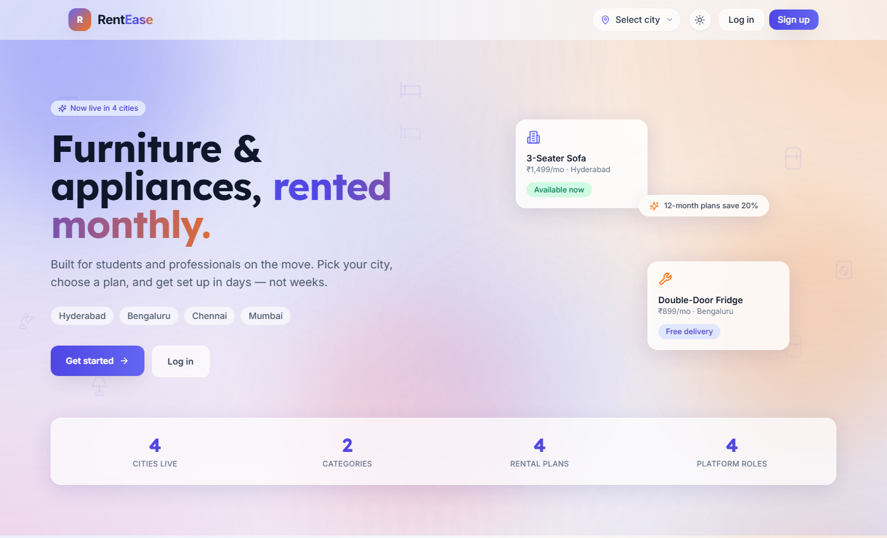
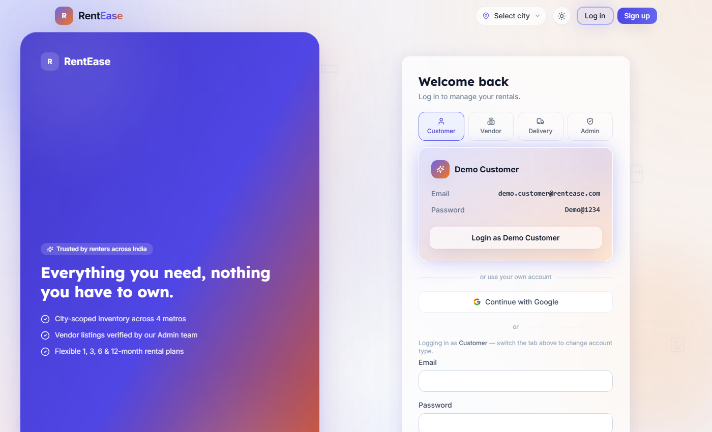
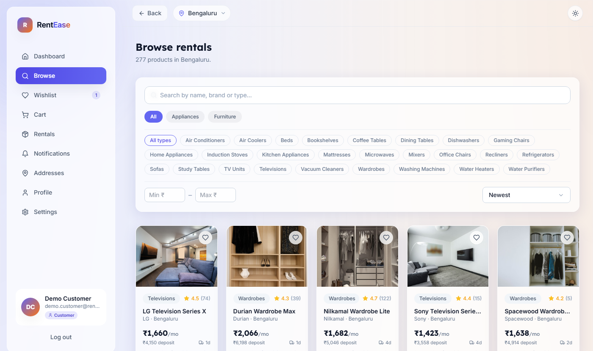
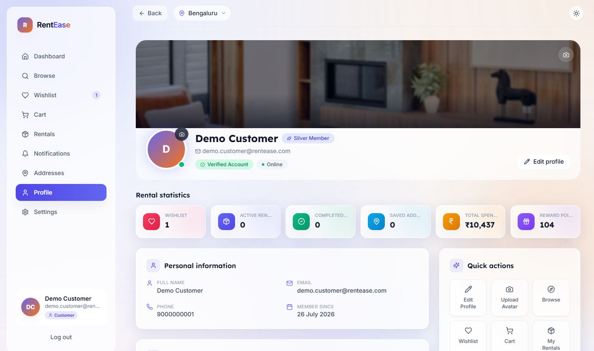
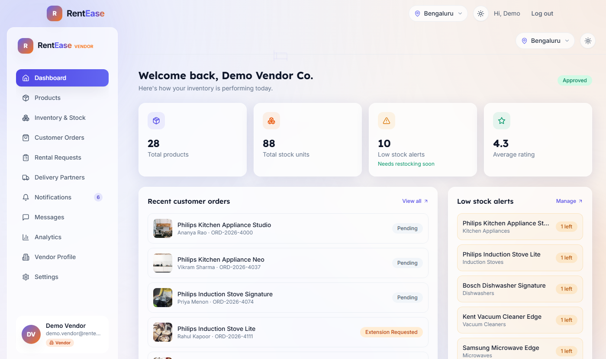
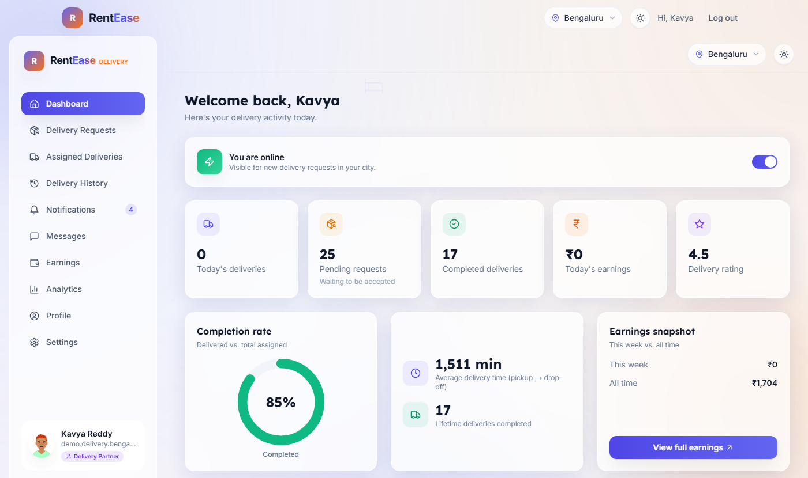
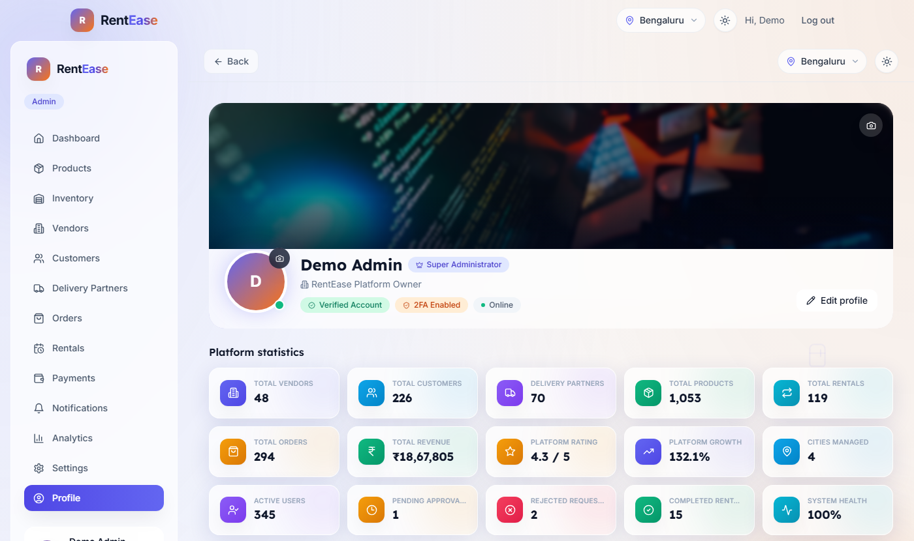

<div align="center">


**Rent quality furniture and appliances on flexible monthly plans — instead of owning them outright.**

A production-grade, multi-vendor, multi-city rental marketplace with four purpose-built portals (Customer, Vendor, Delivery Partner, Admin), a 121-endpoint REST API, and a single unified Vercel deployment.

[](https://rentease-furniture-rental-ecru.vercel.app)

[](https://nextjs.org)
[](https://react.dev)
[](https://expressjs.com)
[](https://www.mongodb.com)
[](https://mongoosejs.com)
[](https://redux-toolkit.js.org)
[](https://tailwindcss.com)
[](https://www.framer.com/motion)
[](https://jwt.io)
[](https://vercel.com)
[](LICENSE)

🔗 **Live Application →** [rentease-furniture-rental-ecru.vercel.app](https://rentease-furniture-rental-ecru.vercel.app)
&nbsp;·&nbsp; 💻 **Source →** [github.com/sakethnalajala/RentEase-Furniture-Appliance-Rental-Platform-Project](https://github.com/sakethnalajala/RentEase-Furniture-Appliance-Rental-Platform-Project)

</div>

---

## 📋 Table of Contents

- [Overview](#-overview)
- [Key Features by Module](#-key-features-by-module)
- [Screenshots](#-screenshots)
- [Tech Stack](#-tech-stack)
- [Architecture Overview](#-architecture-overview)
- [Folder Structure](#-folder-structure)
- [Getting Started](#-getting-started)
- [Environment Variables](#-environment-variables)
- [API Documentation Summary](#-api-documentation-summary)
- [Usage Guide](#-usage-guide)
- [Roadmap](#-roadmap)
- [Contributing](#-contributing)
- [License](#-license)
- [Author](#-author)

---

## 🏠 Overview

Students and working professionals who relocate frequently — for education or work — face a recurring problem: buying furniture and appliances is expensive, hard to transport, and wasteful when a lease ends in a year or less.

**RentEase** solves this with a full **multi-vendor, multi-city rental marketplace**. Customers browse a catalog scoped to their own city, pick a rental tenure (1 / 3 / 6 / 12 months), and check out. Independent, platform-verified vendors fulfil the order, and a dedicated **Delivery Partner** network handles OTP-verified pickup and drop-off — with a platform **Admin** overseeing the whole pipeline in real time.

Every stakeholder gets a dashboard built specifically for their job:

| Portal | Who it's for | Core job-to-be-done |
|---|---|---|
| 🛍️ **Customer** | Renters | Browse, rent, track orders, manage the rental lifecycle |
| 🏢 **Vendor** | Furniture/appliance suppliers | List inventory, fulfil orders, track revenue & delivery performance |
| 🚚 **Delivery Partner** | Logistics staff | Accept jobs, verify OTP pickup/drop-off, track earnings |
| 🛡️ **Admin** | Platform operators | Approve vendors/partners, oversee orders & payments, view analytics |

**Zero-cost-to-evaluate by design.** Every paid third-party integration (Razorpay, Twilio, SMTP, Cloudinary, Firebase, Google OAuth) has a safe, console-logged simulation it falls back to automatically when no API key is configured — the *entire* order lifecycle (checkout → vendor confirmation → delivery-partner pickup → OTP drop-off → active rental) runs and can be demoed end-to-end without spending a rupee on infrastructure. Flip real credentials in and the exact same code paths call the real providers.

**Never an empty dashboard.** Every account — demo or freshly self-registered — is auto-populated with realistic, internally-consistent data (products, orders, wishlist items, delivery history, notifications) at the moment it's created, so a brand-new Vendor or Delivery Partner sees a working business from their very first login, not a blank screen.

---

## ✨ Key Features by Module

### 🛍️ Customer Portal
- City-scoped catalog with category/subcategory filters, price range, live search, and sort
- Wishlist, multi-item cart, and a full checkout flow with rental-plan selection (1/3/6/12-month tenures, tenure-based discounts)
- Order tracking across the full rental lifecycle — placed → confirmed → out for delivery → active rental → returned/completed
- **Premium executive-style profile**: lazy-loaded cover photo, avatar upload, real rental statistics (wishlist count, active/completed rentals, saved addresses, total spend, reward points), and a derived Bronze → Silver → Gold → Platinum membership tier computed from genuine order history
- Saved addresses, in-app notifications, product reviews
- Login via email/password, phone OTP, or simulated Google OAuth — optional 2FA

### 🏢 Vendor Portal
- **Instant onboarding**: self-registration auto-approves the vendor and auto-generates a real, internally-consistent starter catalog (5–9 product types, realistic pricing/images/stock) plus order history — the dashboard is genuinely populated from the first login
- Product & inventory management with auto-generated QR codes and barcodes per unit (`qrcode` + `bwip-js`)
- Order fulfilment workflow (confirm → prepare → hand off to a delivery partner) with low-stock alerts
- Delivery-partner performance analytics scoped to the vendor's own order history
- Revenue and rental analytics dashboard
- Dedicated Vendor Profile page with image upload and business details

### 🚚 Delivery Partner Portal
- City-scoped, auto-replenished open-request queue — accept or reject jobs in real time
- Pickup → OTP-verified drop-off workflow (`pickup` and `deliver` actions), each step timestamped and audited
- Earnings breakdown (today / this week / all-time) and performance analytics (completion rate, average delivery time, lifetime deliveries)
- Availability toggle (go online/offline to control visibility for new requests)
- New partners are auto-seeded with a realistic mix of completed and in-progress deliveries so History, Earnings, and Ratings are never blank

### 🛡️ Admin Portal
- **Executive Profile dashboard**: 15 live, animated platform-statistic cards (vendors, customers, delivery partners, products, rentals, orders, revenue, platform rating/growth, cities managed, active users, pending/rejected requests, completed rentals, system health), premium cover with glassmorphism hero, personal/platform/contact/security info panels, quick actions, and an executive summary sidebar (today's revenue/rentals/orders, server/database/API health)
- Vendor & Delivery Partner lifecycle management — approve / reject / suspend / reactivate
- **Instant vendor approvals**: Approve/Reject optimistically updates the UI the moment it's clicked (row moves tabs, toast fires immediately) instead of blocking on the backend's demo-data-generation step, with automatic rollback only if the request genuinely fails
- Platform-wide analytics, order/rental/payment oversight across every city
- Category, product, and rental-plan configuration; commission & GST settings
- Broadcast notifications to a user segment
- Mandatory TOTP-based 2FA on every admin account

### ⚙️ Platform-wide Engineering
- **Simulated Google OAuth account picker** with real product logic: zero accounts for a role → sign straight into that role's Demo Account; exactly one real account → sign straight in; two or more → a role-scoped account chooser (never mixes accounts across roles, never surfaces seed/filler data)
- **Prefetch-on-login**: every role's dashboard queries start fetching the instant a session begins (including the real Google OAuth callback), so the destination portal often already has data by the time it mounts
- Skeleton-based route loading (`loading.js` per segment) — no blank white-screen transitions between pages
- Dark mode, a full glassmorphism design system, and Framer Motion micro-interactions throughout
- Helmet + CORS + `express-rate-limit` hardened API; every mutating route validated with Zod schemas
- JWT access tokens (short-lived, in-memory) + rotating httpOnly refresh tokens; RBAC middleware per route

---

## 🖼️ Screenshots

<table>
<tr>
<td width="50%"><p align="center"><sub>Public homepage — city-aware hero, live catalog stats</sub></p></td>
<td width="50%"><p align="center"><sub>Unified login — role tabs, demo tiles, Google & OTP sign-in</sub></p></td>
</tr>
<tr>
<td width="50%"><p align="center"><sub>Customer — city-scoped catalog with live filters</sub></p></td>
<td width="50%"><p align="center"><sub>Customer — premium profile with real rental statistics</sub></p></td>
</tr>
<tr>
<td width="50%"><p align="center"><sub>Vendor — inventory, orders, and low-stock alerts</sub></p></td>
<td width="50%"><p align="center"><sub>Delivery Partner — earnings, completion rate, live requests</sub></p></td>
</tr>
<tr>
<td colspan="2"><p align="center"><sub>Admin — executive profile with 15 live, animated platform-statistic cards</sub></p></td>
</tr>
</table>

---

## 🧰 Tech Stack

<table>
<tr><td valign="top"><strong>Frontend</strong></td><td>

Next.js 14 (App Router) · React 18 · Redux Toolkit + RTK Query · Tailwind CSS 3 · Framer Motion · next-themes (dark mode) · Sonner (toasts) · Lucide React (icons)

</td></tr>
<tr><td valign="top"><strong>Backend</strong></td><td>

Node.js · Express.js · MongoDB + Mongoose (25 schemas) · Zod (validation) · JWT (`jsonwebtoken`) · bcryptjs · Helmet · CORS · express-rate-limit · Passport + `passport-google-oauth20` (Google OAuth) · Speakeasy + `qrcode` (TOTP 2FA) · Multer + `multer-storage-cloudinary` (uploads) · `bwip-js` (barcodes)

</td></tr>
<tr><td valign="top"><strong>Optional integrations</strong><br/><sub>(auto-simulated when unconfigured)</sub></td><td>

Razorpay (payments) · Cloudinary (image hosting) · Twilio (SMS/WhatsApp) · Nodemailer/SMTP (email) · Firebase Admin (push notifications) · PDFKit (invoices)

</td></tr>
<tr><td valign="top"><strong>Tooling & Testing</strong></td><td>

Jest + Supertest (API tests) · `mongodb-memory-server` (ephemeral local DB, no MongoDB install required) · ESLint (`next/core-web-vitals`) · nodemon

</td></tr>
<tr><td valign="top"><strong>Deployment</strong></td><td>

**Single unified Vercel project** — the Next.js frontend and the Express API (wrapped as one Vercel serverless function) deploy together from one repository, one build, one production domain. No separate backend host required.

</td></tr>
</table>

---

## 🏗️ Architecture Overview

### System diagram

```
                              ┌───────────────────────────┐
                              │          Browser            │
                              │  Customer / Vendor / Delivery│
                              │        / Admin portal        │
                              └─────────────┬─────────────┘
                                            │ HTTPS
                              ┌─────────────▼─────────────┐
                              │   rentease-furniture-       │
                              │   rental-ecru.vercel.app     │
                              │  (single Vercel deployment)  │
                              └─────────────┬─────────────┘
                          ┌──────────────────┼──────────────────┐
                          │ /  (all other routes)                │ /api/v1/*
             ┌────────────▼────────────┐          ┌─────────────▼─────────────┐
             │  Next.js 14 App Router    │          │  Express REST API           │
             │  Redux Toolkit + RTK Query│  fetch   │  (Vercel serverless fn)     │
             │  Server + Client Components│◄────────┤  Auth · RBAC · Zod          │
             └────────────────────────────┘          │  Controllers · Services    │
                                                       └──┬──────┬──────┬──────┬──┘
                                          ┌────────────────┘      │      │      └───────────────┐
                                          ▼                       ▼      ▼                       ▼
                                   ┌─────────────┐         ┌──────────┐ ┌────────┐     ┌───────────────────┐
                                   │  MongoDB     │         │Cloudinary│ │Razorpay│     │Twilio / SMTP / FCM │
                                   │  (Mongoose)  │         │(uploads) │ │(payments)│    │(SMS / Email / Push)│
                                   └─────────────┘         └──────────┘ └────────┘     └───────────────────┘
                                                                          all four optional — safe, console-logged
                                                                          simulation used automatically when unconfigured
```

### Monorepo layout

```
RentEase/
├── backend/     Express REST API — wrapped as a Vercel serverless function at backend/api/index.js
└── frontend/    Next.js 14 App Router client
```

### Backend modules

| Module | Responsibility |
|---|---|
| `config/` | Env loading, DB connection, third-party SDK clients (Cloudinary, Firebase, Passport, Razorpay, Twilio, mailer) |
| `constants/` | Roles, order/inventory-status enums, demo-account definitions, supported cities |
| `models/` | 25 Mongoose schemas — users, catalog, orders, payments, delivery, and platform-admin data |
| `middlewares/` | JWT auth, RBAC, Zod validation, file uploads, rate limiting, centralized error handling |
| `controllers/` | Business logic per resource (auth, product, order, delivery, vendor, admin, …) |
| `routes/` | Express routers mapping URLs to controllers, mounted under `/api/v1` |
| `services/` | Cross-cutting domain logic — token issuance/rotation, OTP, 2FA, vendor/customer/delivery-partner onboarding, demo-order top-up |
| `validators/` | Zod schemas consumed by the `validate` middleware |
| `data/` & `seed.js` | Deterministic demo-data generation for a fully populated first-run experience |

### Frontend modules

| Module | Responsibility |
|---|---|
| `app/` | App Router pages, grouped by role: `(auth)/`, `customer/`, `vendor/`, `delivery/`, `admin/`, `oauth/` |
| `store/` | Redux Toolkit store — one RTK Query API slice per backend resource (`authApi`, `customerApi`, `vendorApi`, `deliveryApi`, `adminApi`, `orderApi`, …) |
| `components/` | Shared UI primitives (`ui/`) plus feature components grouped by portal |
| `lib/` | Client-side helpers, demo-account metadata, checkout/invoice utilities |
| `hooks/` | Reusable React hooks |
| `middleware.js` | Next.js edge middleware for route-level auth guarding |

### Request flow — placing a rental order

1. **Customer** adds an item to the cart (`POST /cart`) and checks out.
2. `POST /orders/checkout` creates `Order` + `OrderItem` + `Payment` documents (simulated instant success unless Razorpay is configured; Cash on Delivery stays `pending` until handover).
3. The **Vendor** confirms the item, which opens it as an unassigned delivery request visible to partners in that city.
4. A **Delivery Partner** accepts it, picks it up, and verifies drop-off with a 4-digit OTP — moving the item to `active_rental`.
5. In-app notifications fire at every step for every affected user.
6. The **Admin** observes the entire pipeline — and every other city's — from platform-wide analytics in real time.

### Authentication & authorization

- **JWT access tokens** (short-lived, kept client-side in memory) + **httpOnly refresh tokens** (rotated on every use).
- **RBAC middleware** restricts each route to the roles allowed to call it.
- **Mandatory TOTP 2FA** for Admin accounts (`speakeasy` + `qrcode`).
- **Simulated Google OAuth** and **phone OTP** as alternate, fully-functional login paths.

---

## 📁 Folder Structure

```
RentEase-Furniture-Appliance-Rental-Platform-Project/
├── backend/
│   ├── api/                  # Vercel serverless entry point
│   ├── src/
│   │   ├── config/           # env, DB, third-party SDK setup
│   │   ├── constants/        # roles, statuses, demo accounts, cities
│   │   ├── controllers/      # ~15 resource controllers
│   │   ├── data/             # demo product/city/delivery data pools
│   │   ├── middlewares/      # auth, rbac, validate, upload, rateLimit, errorHandler
│   │   ├── models/           # 25 Mongoose schemas
│   │   ├── routes/           # 15 Express routers → /api/v1/*
│   │   ├── services/         # onboarding, tokens, OTP, 2FA, notifications
│   │   ├── utils/            # ApiError, ApiResponse, asyncHandler, logger
│   │   ├── validators/       # Zod request schemas
│   │   ├── app.js            # Express app assembly
│   │   ├── server.js         # local dev entry point
│   │   └── seed.js           # demo-data seeding orchestrator
│   ├── scripts/startMongo.js # in-memory MongoDB for zero-install local dev
│   └── package.json
├── frontend/
│   ├── app/
│   │   ├── (auth)/           # login, register, password reset, email verify
│   │   ├── customer/         # browse, cart, wishlist, rentals, profile, …
│   │   ├── vendor/           # products, inventory, orders, analytics, profile
│   │   ├── delivery/         # requests, assigned, history, earnings, profile
│   │   ├── admin/            # vendors, customers, orders, analytics, profile
│   │   └── oauth/callback/   # real Google OAuth redirect target
│   ├── components/           # ui/, admin/, vendor/, customer/, auth/, layout/
│   ├── store/                # Redux Toolkit + RTK Query slices
│   ├── lib/ & hooks/         # client utilities and reusable hooks
│   └── package.json
├── docs/assets/               # README screenshots & logo
├── vercel.json                 # single-project routing: /api/* → backend, else → frontend
└── LICENSE
```

---

## 🚀 Getting Started

### Prerequisites

| Requirement | Version | Notes |
|---|---|---|
| [Node.js](https://nodejs.org) | 18+ | Required for both `frontend` and `backend` |
| npm | bundled with Node | Package manager used throughout |
| MongoDB | — | **Not required to install** — see below |

### 1. Clone

```bash
git clone https://github.com/sakethnalajala/RentEase-Furniture-Appliance-Rental-Platform-Project.git
cd RentEase-Furniture-Appliance-Rental-Platform-Project
```

### 2. Backend

```bash
cd backend
npm install
cp .env.example .env        # set MONGODB_URI at minimum — see Environment Variables
```

### 3. Start a local database (no install required)

In its own terminal (leave running):

```bash
npm run mongo
```

> Prefer a real database? Point `MONGODB_URI` at a local `mongod` or a free [MongoDB Atlas](https://www.mongodb.com/atlas) cluster instead, and skip this step.

### 4. Seed demo data & start the API

In a second terminal:

```bash
npm run seed   # cities, categories, demo accounts, catalog, orders
npm run dev    # http://localhost:5000, hot-reload via nodemon
```

```bash
curl http://localhost:5000/api/v1/health
```

### 5. Frontend

In a third terminal:

```bash
cd frontend
npm install
cp .env.local.example .env.local
npm run dev    # http://localhost:3000
```

### 6. Run the test suite

```bash
cd backend
npm test
```

### Verification checklist

- [ ] `GET http://localhost:5000/api/v1/health` → `200 OK`
- [ ] `http://localhost:3000` loads the homepage
- [ ] Logging in with a demo account (see [Usage Guide](#-usage-guide)) lands on the correct role's dashboard

---

## 🔐 Environment Variables

### Backend — `backend/.env`

| Variable | Required | Description |
|---|:---:|---|
| `NODE_ENV` | No | `development` \| `production` |
| `PORT` | No | API port (default `5000`) |
| `CLIENT_URL` | **Yes** | Frontend origin — used for CORS & redirects |
| `MONGODB_URI` | **Yes** | MongoDB connection string |
| `DEMO_MODE` | No | `true` (default) relaxes email/phone verification for demo use |
| `JWT_ACCESS_SECRET` / `JWT_REFRESH_SECRET` | **Yes** | Sign JWTs — change in production |
| `JWT_ACCESS_EXPIRES_IN` / `JWT_REFRESH_EXPIRES_IN` | No | Token lifetimes (default `15m` / `30d`) |
| `EMAIL_TOKEN_SECRET` | **Yes** | Email-verification / password-reset token secret |
| `SMTP_HOST` / `SMTP_PORT` / `SMTP_USER` / `SMTP_PASS` / `SMTP_FROM` | No | Outbound email — console-logged when blank |
| `TWILIO_ACCOUNT_SID` / `TWILIO_AUTH_TOKEN` / `TWILIO_PHONE_NUMBER` / `TWILIO_WHATSAPP_NUMBER` | No | SMS/WhatsApp — console-logged when blank |
| `GOOGLE_CLIENT_ID` / `GOOGLE_CLIENT_SECRET` / `GOOGLE_CALLBACK_URL` | No | Real Google OAuth — simulated picker used when blank |
| `CLOUDINARY_CLOUD_NAME` / `CLOUDINARY_API_KEY` / `CLOUDINARY_API_SECRET` | No | Image uploads — local disk storage when blank |
| `RAZORPAY_KEY_ID` / `RAZORPAY_KEY_SECRET` | No | Payments — simulated instant-success gateway when blank |
| `FIREBASE_PROJECT_ID` / `FIREBASE_CLIENT_EMAIL` / `FIREBASE_PRIVATE_KEY` | No | Push notifications — console-logged when blank |
| `RATE_LIMIT_WINDOW_MS` / `RATE_LIMIT_MAX` | No | API rate-limit window/threshold |

### Frontend — `frontend/.env.local`

| Variable | Required | Description |
|---|:---:|---|
| `NEXT_PUBLIC_API_URL` | **Yes** | Base URL of the backend API, e.g. `http://localhost:5000/api/v1` |

> **Secrets hygiene:** `.env` / `.env.local` are gitignored — only `*.example` templates are tracked. Rotate every secret before a real production deployment, and set them through your host's secret manager (Vercel Project Settings → Environment Variables) rather than shipping a file.

---

## 📚 API Documentation Summary

**121 REST endpoints** across **15 resource routers**, all prefixed with **`/api/v1`**. Authenticated routes expect `Authorization: Bearer <accessToken>`.

<details>
<summary><strong>Auth</strong> — <code>/auth</code> (20 endpoints)</summary>

| Method | Endpoint | Description |
|---|---|---|
| `POST` | `/auth/register` | Register a new account (any self-registerable role) |
| `POST` | `/auth/verify-email` / `/auth/resend-verification` | Email verification |
| `POST` | `/auth/login` | Email/password login (returns a 2FA challenge if enabled) |
| `POST` | `/auth/login/2fa` | Complete login with a TOTP code |
| `POST` | `/auth/2fa/disable` | Disable 2FA |
| `POST` | `/auth/otp/request` / `/auth/otp/verify` | Phone OTP login |
| `POST` | `/auth/forgot-password` / `/auth/reset-password` | Password reset |
| `POST` | `/auth/refresh` / `/auth/logout` | Session rotation / termination |
| `GET` | `/auth/google` | Google OAuth entry point |
| `GET` | `/auth/google/accounts` | List real accounts for a role (drives the account picker) |
| `POST` | `/auth/google/select` | Sign into a specifically chosen account |

</details>

<details>
<summary><strong>Catalog</strong> — <code>/products</code>, <code>/categories</code>, <code>/cities</code></summary>

| Method | Endpoint | Description |
|---|---|---|
| `GET` | `/products` | List products — filter by city, category, vendor, search, sort, paginate |
| `GET` | `/products/:id` | Product detail |
| `GET` | `/products/subcategories` | List subcategories |
| `GET` | `/categories` | List categories |
| `GET` | `/cities` | List supported cities |

</details>

<details>
<summary><strong>Cart, Wishlist & Addresses</strong></summary>

| Method | Endpoint | Description |
|---|---|---|
| `GET` / `POST` / `PATCH` / `DELETE` | `/cart` | Manage cart |
| `GET` / `POST` / `DELETE` | `/wishlist` | Manage wishlist |
| `GET` / `POST` / `PATCH` / `DELETE` | `/addresses` | Manage saved delivery addresses |

</details>

<details>
<summary><strong>Orders</strong> — <code>/orders</code> (Customer & Vendor)</summary>

| Method | Endpoint | Description |
|---|---|---|
| `POST` | `/orders/checkout` | Place an order |
| `GET` | `/orders/my` / `/orders/my/items` | Current customer's orders/items |
| `POST` | `/orders/items/:itemId/cancel` | Cancel an item |
| `GET` | `/orders/vendor/my` | Orders placed against a vendor's catalog |
| `PATCH` | `/orders/vendor/items/:itemId/status` | Vendor confirms/rejects an item |

</details>

<details>
<summary><strong>Delivery Partner</strong> — <code>/delivery</code> (15 endpoints)</summary>

| Method | Endpoint | Description |
|---|---|---|
| `GET` / `PATCH` | `/delivery/me` | Profile |
| `PATCH` | `/delivery/me/availability` | Go online/offline |
| `POST` | `/delivery/me/documents` / `/me/photo` | Upload KYC docs / profile photo |
| `GET` | `/delivery/requests` | Open requests in the partner's city |
| `POST` | `/delivery/requests/:itemId/accept` \| `/reject` | Accept/reject |
| `GET` | `/delivery/assigned` | Currently assigned deliveries |
| `PATCH` | `/delivery/assigned/:itemId/pickup` \| `/deliver` | Mark picked up / OTP-verified drop-off |
| `GET` | `/delivery/history` / `/earnings` / `/stats` | History, earnings, performance |

</details>

<details>
<summary><strong>Vendor</strong> — <code>/vendors</code></summary>

| Method | Endpoint | Description |
|---|---|---|
| `GET` / `PATCH` | `/vendors/me` | Profile |
| `POST` | `/vendors/me/image` | Upload profile/cover/logo image |
| `GET` | `/vendors/me/stats` | Revenue, orders & inventory KPIs |
| `GET` | `/vendors/me/delivery-partners` / `/delivery-analytics` | Delivery-partner performance for this vendor |

</details>

<details>
<summary><strong>Admin</strong> — <code>/admin</code> (42 endpoints)</summary>

| Method | Endpoint | Description |
|---|---|---|
| `GET` | `/admin/stats` / `/admin/analytics` | Platform-wide KPIs & analytics |
| `GET` / `PATCH` / `DELETE` | `/admin/vendors`, `/admin/delivery-partners` | Manage vendors & delivery partners |
| `POST` | `.../:id/approve` \| `/reject` \| `/suspend` \| `/reactivate` | Lifecycle actions |
| `GET` / `POST` / `PATCH` / `DELETE` | `/admin/products`, `/admin/categories` | Platform catalog management |
| `GET` | `/admin/inventory`, `/admin/customers` | Inventory & customer oversight |
| `GET` | `/admin/orders`, `/admin/rentals`, `/admin/payments`, `/payments/summary` | Platform-wide oversight |
| `GET` / `PATCH` | `/admin/settings` | Commission %, GST, policies |
| `GET` / `PUT` / `DELETE` | `/admin/rental-plans` | Rental tenure & discount configuration |
| `POST` | `/admin/notifications/broadcast` | Broadcast to a user segment |

</details>

<details>
<summary><strong>Notifications</strong> — <code>/notifications</code></summary>

| Method | Endpoint | Description |
|---|---|---|
| `GET` | `/notifications` / `/unread-count` | List / unread badge count |
| `PATCH` | `/:id/read` \| `/read-all` | Mark as read |
| `DELETE` | `/:id` | Delete |

</details>

### Example request

```bash
# Log in as the demo customer
curl -X POST https://rentease-furniture-rental-ecru.vercel.app/api/v1/auth/login \
  -H "Content-Type: application/json" \
  -d '{"email":"demo.customer@rentease.com","password":"Demo@1234","role":"customer"}'

# Use the returned accessToken to fetch a city's catalog
curl "https://rentease-furniture-rental-ecru.vercel.app/api/v1/products?city=<CITY_ID>&sort=newest&limit=12" \
  -H "Authorization: Bearer <ACCESS_TOKEN>"
```

---

## 📖 Usage Guide

### Demo accounts

RentEase seeds one-click demo accounts for every role. All share the password `Demo@1234` (Admin: `Admin@123`, and requires TOTP 2FA on first login):

| Role | Email | Password |
|---|---|---|
| Customer | `demo.customer@rentease.com` | `Demo@1234` |
| Vendor | `demo.vendor@rentease.com` | `Demo@1234` |
| Delivery Partner | `demo.delivery@rentease.com` | `Demo@1234` |
| Admin | `admin@rentease.com` | `Admin@123` |

These are also shown directly on the app's login/register pages — click a role tab, then **"Login as Demo …"**.

### Typical customer flow

1. Open the [live app](https://rentease-furniture-rental-ecru.vercel.app) and select a city.
2. Log in (or register) as a Customer.
3. `Browse` → filter by category/subcategory → open a product to see monthly rent, deposit, and tenure options.
4. Add to cart, choose a delivery address, and check out.
5. Track the order under `Rentals` through confirmation, delivery, and the active rental period.
6. Visit `Profile` to see real, live rental statistics and membership tier.

### Typical vendor flow

1. Register as a Vendor with a business name and operating city.
2. Land straight on a fully-populated Dashboard — real starter products and order history are generated automatically.
3. Manage `Products` / `Inventory & Stock`, fulfil `Customer Orders`, and monitor `Delivery Partners` performance.

### Typical admin flow

1. Log in as Admin (2FA required).
2. Approve, reject, suspend, or reactivate vendors and delivery partners under `Vendors` / `Delivery Partners` — approvals apply instantly in the UI.
3. Review platform-wide `Analytics`, `Orders`, `Payments`, and configure `Settings` / rental plans.

---

## 🗺️ Roadmap

- [ ] Native mobile apps for Customers and Delivery Partners
- [ ] Live, real-time order/delivery tracking over WebSockets
- [ ] Subscription bundles and auto-renewing rental plans
- [ ] Automated vendor payout / settlement reporting
- [ ] In-app chat between customers, vendors, and delivery partners
- [ ] Multi-language and multi-currency support for broader geographic expansion
- [ ] Public OpenAPI/Swagger documentation
- [ ] Expanded automated test coverage (unit + integration) across all four portals

---

## 🤝 Contributing

1. Fork the repository or create a branch off `main`, using `feature/<short-description>`, `fix/<short-description>`, or `chore/<short-description>`.
2. Make focused, descriptive commits.
3. Before opening a PR:
   ```bash
   cd frontend && npm run lint
   cd backend && npm test
   ```
4. Open a pull request against `main` describing **what** changed and **why**.

**Code style:** Frontend uses ESLint (`next/core-web-vitals`); backend is plain CommonJS validated with Zod per route — keep controllers thin, push business logic into `services/`. Prefer [Conventional Commits](https://www.conventionalcommits.org/) (`feat:`, `fix:`, `docs:`, `chore:`).

**PR checklist:** builds locally · `npm test` passes · `npm run lint` passes · no secrets in the diff · README/docs updated if setup or behavior changed.

---

## 📄 License

Distributed under the **MIT License**. See [`LICENSE`](LICENSE) for the full text.

---

## 👤 Author

**Saketh Nalajala**

[](https://github.com/sakethnalajala)

Built as a full-stack capstone project — Unified Mentor Internship Program.

<div align="center">
<sub>⭐ If this project helped you, consider starring the repository.</sub>
</div>
